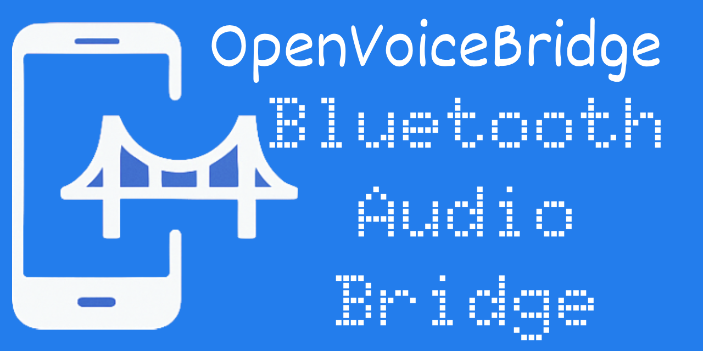

# OpenVoiceBridge: Bluetooth Audio Bridge


An open hardware–software platform that gives end users controlled, transparent access to their own call audio for real-time translation, captioning, accessibility, language learning, and AI-assisted communication. The system does not modify smartphones or mobile OS internals and operates strictly within standard Bluetooth profiles.

## Executive Summary
- Mobile operating systems intentionally limit API access to in-call audio, which slows down innovation in real-time translation, captioning, accessibility, and AI-driven communication tools.
- OpenVoiceBridge combines two standard Bluetooth roles (HF and AG) inside one device, forming a transparent, user-controlled audio relay between the phone and the headset.
- The MCU routes SCO audio and mirrors the user's own stream to optional on-device or cloud STT/LLM pipelines—without altering call content and without introducing any new participants into the communication.
- All hardware, firmware, documentation, and legal guidance in this repository are fully open for audit and research.

## Project Goals
1. Provide users controlled access to their own call audio without modifying smartphones.
2. Enable real-time translation, AR subtitles, hearing assistance, language learning, and AI call coaching.
3. Address supplier and regulator requirements through a transparent design and a built-in optional Notification Mode.
4. Deliver a complete reference implementation of a standards-compliant hardware HFP bridge.

## Problem Statement
| Constraint | Consequence |
|------------|-------------|
| Android/iOS restrict programmatic access to call audio | No in-call translation, captioning, or AI assistants |
| No commercial HF↔AG bridge exists | Users cannot process their own speech in real time |
| BT vendors do not expose dual-role stacks | Builders must assemble their own hardware |
| Regulatory expectations are unclear | Component sourcing may face unnecessary delays |

## Solution Overview
OpenVoiceBridge uses two **FSC-BT1036x** (Feasycom Bluetooth 5.2) modules:

- **Module A** (HF role) — paired with the phone
- **Module B** (AG role) — paired with the headset

The MCU transparently routes audio between them via I2S and mirrors the user's own audio stream to user-selected processing apps.

```
Phone (HFP) ── FSC-BT1036 A (HF) ──┐
                                    │ I2S (16kHz, 16-bit, mono)
                                    ▼
                              ESP32-S3 Router ── Wi-Fi/UDP ── STT/LLM/AR
                                    ▲
                                    │ I2S (16kHz, 16-bit, mono)
Headset ── FSC-BT1036 B (AG) ───────┘
```

### Current Implementation (v0.1 PoC)

The current firmware implements **single-module RX capture**:

```
Phone (HFP) ── FSC-BT1036 (HF, I2S slave) ──► ESP32-S3 ──► Wi-Fi/UDP ──► PC (WAV)
                     I2S: BCLK/WS/DO → ESP DIN
```

The ESP32-S3 acts as I2S master, clocks the BT1036 as slave, receives 16 kHz audio during a call, and streams raw PCM frames over UDP. The `scripts/udp_capture.py` tool captures these frames and writes a `.wav` file.

## Hardware

### Bill of Materials
| Component | Part | Notes |
|-----------|------|-------|
| BT Module | FSC-BT1036x (Feasycom) | HFP/A2DP/AVRCP, 24-bit codec, I2S |
| MCU | ESP32-S3 | Dual-core, Wi-Fi, dual I2S |

### FSC-BT1036x I2S Pins
| Module Pin | Signal | Direction | ESP32-S3 GPIO (current) |
|------------|--------|-----------|--------------------------|
| P30 | I2S_BCLK | Output (slave mode) | GPIO 4 |
| P31 | I2S_WS | Output (slave mode) | GPIO 5 |
| P33 | I2S_DO | Module → ESP | GPIO 6 (DIN) |
| P32 | I2S_DI | ESP → Module | NC (RX only in v0.1) |
| P24 | I2S_MCLK | — | NC (not needed in slave mode) |

> The BT1036 must be configured as **I2S slave** (`AT+I2SCFG=3`) so the ESP32-S3 provides the bit clock. In default factory state the module is I2S master — this will cause a clock conflict.

### FSC-BT1036x Module Configuration (AT commands via UART)

Before first use, send these AT commands to the BT1036 over its UART (115200 8N1):

```
# Set I2S slave mode, 48kHz base clock, 16-bit depth
AT+I2SCFG=3

# Set HFP SCO sample rate to 16 kHz (ESP firmware matches this)
AT+HFPSR=16000

# Enable HFP profile
AT+PROFILE=1

# Save & reboot
AT+REBOOT
```

After a call is active the module outputs 16 kHz, 16-bit, mono PCM on I2S_DO.

**AT+I2SCFG bit field reference:**

| Bit | 0 = OFF / A | 1 = ON / B |
|-----|-------------|------------|
| 0 | I2S disabled | I2S enabled |
| 1 | Master | Slave |
| 2 | 48 kHz | 44.1 kHz |
| 3–4 | `00` = 16-bit | `10` = 32-bit (16 MSB effective) |
| 5–6 | I2S standard | PCM short frame |

Value `3` = binary `000011` = enabled + slave + 48 kHz + 16-bit + I2S standard.

**AT+HFPSR values:** `0` (auto) / `8000` / `16000` / `48000` Hz. Overrides `AT+I2SCFG` sample rate during voice calls.

### Wiring Diagram (v0.1 single-module PoC)

```
FSC-BT1036x          ESP32-S3
───────────          ────────
     P30 (BCLK)  ──► GPIO 4
     P31 (WS)    ──► GPIO 5
     P33 (DO)    ──► GPIO 6
     GND         ──  GND
     VDD (3.3V)  ──  3.3V
     P0 (UART_TX)──► UART RX  (for AT commands)
     P1 (UART_RX)◄── UART TX  (for AT commands)
     P15 (RESET) ──  10kΩ ──  3.3V  (active low, pull high)
```

## Software

### Quick Start

1. Flash ESP32-S3:
```bash
idf.py build flash monitor
```

2. Edit Wi-Fi credentials and UDP target in `main/main.c`:
```c
#define WIFI_SSID       "your_ssid"
#define WIFI_PASS       "your_password"
#define UDP_REMOTE_IP   "192.168.1.50"
#define UDP_REMOTE_PORT (5004)
```

3. Capture audio on the receiving PC:
```bash
python scripts/udp_capture.py --port 5004 --outfile call.wav
```

4. Make or receive a call on the phone paired to the BT1036. Audio streams immediately.

### Firmware Architecture

```
app_main()
  ├── wifi_connect_sta()          — join AP, wait for IP
  ├── xRingbufferCreate()         — 50-frame ring buffer (BYTEBUF)
  ├── i2s_rx_init()               — I2S_NUM_0, master, 16kHz, 16-bit, mono
  ├── i2s_rx_task  (core 0, p20) — i2s_channel_read → ring buffer
  └── udp_tx_task  (core 1, p10) — ring buffer → sendto()
```

**Frame parameters:**
| Parameter | Value |
|-----------|-------|
| Sample rate | 16 000 Hz |
| Bit depth | 16-bit PCM |
| Channels | Mono |
| Frame size | 20 ms = 320 samples = 640 bytes |
| Ring buffer | 50 frames = 32 000 bytes |
| UDP port | 5004 |

### `scripts/udp_capture.py`

Receives UDP frames and writes a standard WAV file. Supports configurable rate/channels/width to match firmware settings.

```
usage: udp_capture.py [--bind IP] [--port PORT] [--outfile FILE]
                      [--rate HZ] [--channels N] [--width BYTES]
```

Defaults match firmware: `--rate 16000 --channels 1 --width 2`.

## Key Capabilities
- Transparent HF↔AG audio relay with <40 ms one-way latency (target).
- SCO/eSCO routing with CVSD/mSBC codec support via FSC-BT1036.
- Optional audio mirroring to local buffers, USB Audio Gadget, Wi-Fi/UDP, or BLE channels.
- Plugins for Whisper, Azure Cognitive Services, Google Speech-to-Text, ElevenLabs, and local LLM stacks (planned).
- Notification Mode: automatic spoken disclosure for two-party-consent markets (planned).
- Fully open schematics, firmware, and compliance templates.

## Architecture
### Hardware Layer
| Component | Role | Part |
|-----------|------|------|
| BT Module A | HF (phone side) | FSC-BT1036x |
| BT Module B | AG (headset side) | FSC-BT1036x |
| MCU | I2S router + Wi-Fi stream | ESP32-S3 |

### Roadmap
| Version | Milestones |
|---------|------------|
| 0.1 | Single FSC-BT1036 HF RX → UDP stream (current) |
| 0.2 | Dual-module HF↔AG bridge, bi-directional I2S |
| 0.3 | USB Audio Gadget output, Whisper PoC |
| 0.4 | Wi-Fi API, AR rendering, Notification Mode |
| 1.0 | Complete reference design and prototype |

## Compliance

### What the Device Does
1. Receives audio already available to the user via standard HFP/HSP.
2. Relays that same stream to a headset without altering content.
3. Mirrors the user's own audio into optional STT/translation apps acting as data processors.
4. Publishes schematics and firmware for independent audit and certification.

### What the Device Does Not Do
- does not pair with other people's phones;
- does not operate without the phone owner's participation;
- does not inject or modify communication content;
- does not interact with carrier networks;
- does not store data unless explicitly enabled.

### Compliance Posture
- Uses only public Bluetooth HFP/HSP profiles.
- Speech processing follows the data processor model (GDPR/CCPA/PIPL compliant).
- Notification Mode supports two-party consent compliance.
- Functionally comparable to hearing aids, call-center captioning, and personal accessibility tools.

## Legal Model
- **One-party consent:** Israel, China, UK, France, India, most US states, etc.
- **Two-party consent:** Germany, Switzerland, California, Pennsylvania, etc.
- **STT and LLM services** act as data processors, not conversation participants.

## Use Cases
1. Real-time call translation for mobile and AR glasses.
2. Captions and accessibility support.
3. AI call assistance and coaching.
4. Language learning from real conversations.
5. AR/HUD teleprompter overlays.
6. Personal call recording where permitted.

## Disclaimer
This project exists solely to process a user's own audio for translation, captioning, accessibility, education, and AI assistance.

It must not be used for:

- covert recording of others,
- unauthorized capture of third-party communications,
- violating privacy regulations,
- any surveillance purpose.

Usage is subject to local law. Operators must comply with applicable one-party/two-party consent rules, GDPR/CCPA/PIPL obligations, and telecom regulations. Contributors do not control end-user behavior and do not provide legal advice.

For two-party-consent jurisdictions (Germany, Switzerland, certain US states), Notification Mode enforces required spoken disclosure.
